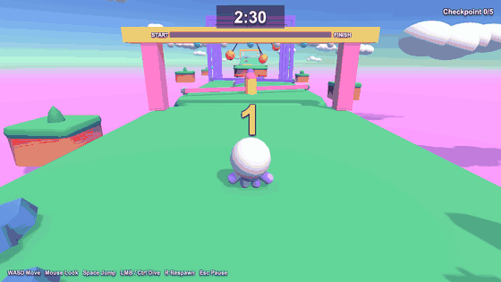
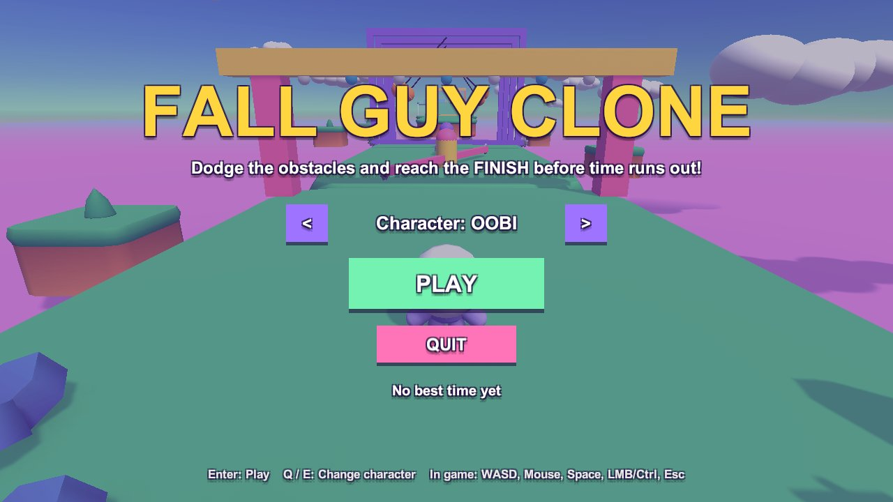
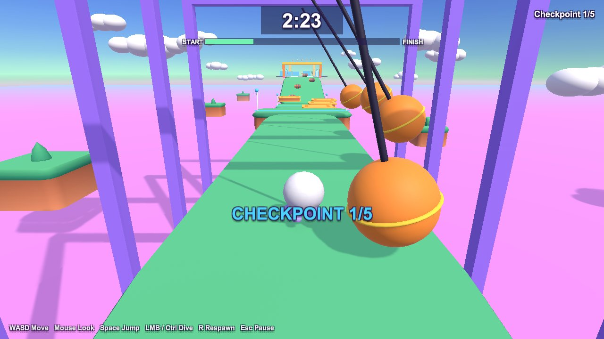
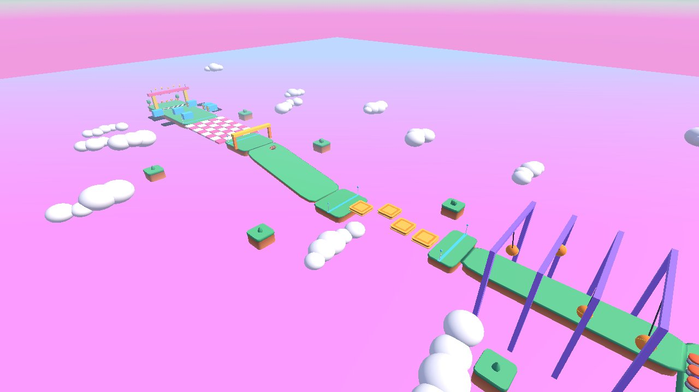
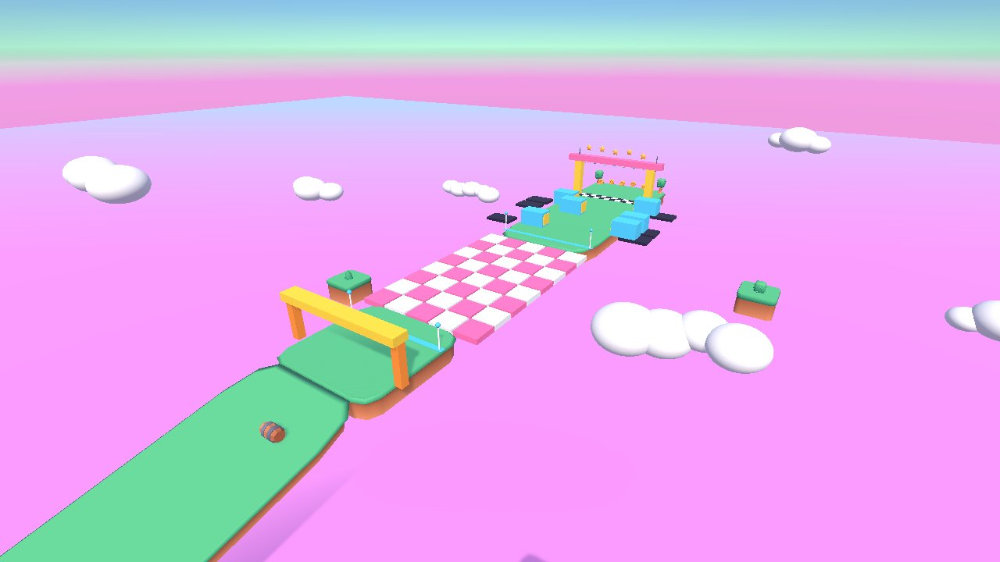

# Fall Guy Clone

A small 3D obstacle-course game inspired by *Fall Guys*, made in Unity for the **Game Development** class.

Run, jump and dive past spinning bars, wrecking balls, rolling barrels and falling tiles. Reach the **FINISH** line before the 2:30 timer runs out.

This is the first project of the class. Use it to practise how to **clone**, **open**, **run** and **build** a Unity project.



| Main menu | In game |
|---|---|
|  |  |

---

## 1. Requirements

| Tool | Version | Notes |
|---|---|---|
| [Unity Hub](https://unity.com/download) | latest | Installs and opens Unity. |
| Unity Editor | **6000.3.8f1** (Unity 6.3) | Install this exact version from Unity Hub > **Installs**. Add the build module for your OS (for example *Mac Build Support* or *Windows Build Support*). |
| [Git](https://git-scm.com/downloads) or [GitHub Desktop](https://desktop.github.com/) | any | Git LFS is **not** needed. |
| Code editor (optional) | VS Code, Visual Studio or Rider | Used to read and edit the C# scripts. |

> Use the exact Unity version. A different version can upgrade the project files and cause errors.

---

## 2. Get the project

**Option A: Git (recommended)**

```bash
git clone https://github.com/hlycadt/FallGuyClone.git
```

**Option B: GitHub Desktop.** Select **File > Clone repository**, then paste the URL above.

**Option C: ZIP.** On the GitHub page, select **Code > Download ZIP**, then extract the ZIP file.

> Keep the project in a short path with no special characters (for example `Documents/Unity/FallGuyClone`).

---

## 3. Open the project

1. Open **Unity Hub**.
2. Select **Add > Add project from disk**, then select the `FallGuyClone` folder (the folder that contains `Assets`, `Packages` and `ProjectSettings`).
3. Make sure the Editor version shows **6000.3.8f1**, then click the project to open it.
4. Wait for the first import. It can take a few minutes, because Unity downloads the packages and builds the `Library` folder.

---

## 4. Run the game

1. In the **Project** window, open `Assets/FallGuyClone/Scenes/FallGuyCourse.unity` (double-click it).
   You can also use the menu **Fall Guy Clone > Open Game Scene**.
2. Press **Play** (the ▶ button at the top of the Editor).
3. Click **PLAY** on the main menu, or press **Enter**.
4. Press **Esc** to pause and unlock the mouse.

### Controls

| Input | Action |
|---|---|
| W A S D / Arrow keys | Move (relative to the camera) |
| Mouse | Rotate the camera |
| Mouse wheel | Zoom the camera |
| Space | Jump |
| Left mouse / Left Ctrl / E | Dive |
| R | Respawn at the last checkpoint |
| Esc / P | Pause |
| Q / E (main menu) | Change character |
| Enter | Start / play again |

### The course

1. **Sweeper arena:** spinning bars. Jump over them. Spring pads launch you up to the bridge.
2. **Wrecking-ball bridge:** swinging balls knock you off.
3. **Sliding platforms:** jump across moving platforms over a gap.
4. **Barrel ramp:** barrels roll down at you.
5. **Falling tiles:** tiles drop a short time after you step on them.
6. **Punching walls:** then the finish line.

If you fall into the pink goo, you go back to the last checkpoint.

| Course from above: wrecking-ball bridge (front) to finish (back) | Falling tiles, punching walls and finish |
|---|---|
|  |  |

---

## 5. Build the game

1. Select **File > Build Profiles**.
2. Select your platform (for example **macOS** or **Windows**). If needed, click **Switch Platform**.
3. Make sure **Scene List** contains only `FallGuyClone/Scenes/FallGuyCourse`.
4. Click **Build**, then select an empty folder, for example `Builds/` inside the project. The `Builds/` folder is ignored by Git.
5. Open the built app and play.

> **macOS:** if the app does not open because it is "from an unidentified developer", right-click the app and select **Open**.

---

## 6. Project structure

All game files are in one folder: `Assets/FallGuyClone`.

```text
FallGuyClone/
├── Assets/
│   ├── FallGuyClone/              ← everything for this game
│   │   ├── Editor/
│   │   │   └── FallGuySetup.cs    Editor menu "Fall Guy Clone", creates the scene and materials
│   │   ├── Materials/             Colour materials and the sky material
│   │   ├── Resources/             Loaded at runtime with Resources.Load()
│   │   │   ├── Kenney/            Free 3D models and animations (CC0)
│   │   │   ├── FallGuyBase.mat
│   │   │   └── FallGuyKenney.mat
│   │   ├── Scenes/
│   │   │   └── FallGuyCourse.unity  ← the game scene
│   │   └── Scripts/
│   │       ├── Core/              Game start, game rules, course building, helpers
│   │       ├── Player/            Player movement, character model, camera
│   │       ├── Obstacles/         Moving obstacles, hazards and triggers
│   │       └── UI/                HUD and menus
│   └── Settings/                  URP render settings and Input System actions
├── Docs/Images/                   Screenshots and GIF used in this README
├── Packages/                      Unity package list (manifest.json)
├── ProjectSettings/               Unity project settings
└── README.md
```

Unity creates these folders on your computer. They are **not** in Git, and you must not commit them: `Library/`, `Temp/`, `Logs/`, `UserSettings/`, `Builds/`, `*.csproj`, `*.slnx`.

---

## 7. How the code works

The whole level is built **from C# code**. There are no prefabs. Read the scripts in this order:

| Script | Folder | What it does |
|---|---|---|
| `FallGuyGame` | Core | Entry point. Sets up the light, course, player, camera and UI when the scene starts. |
| `CourseBuilder` | Core | Builds every section of the course. Edit this file to change the level. |
| `Course` | Core | Stores course data: spawn point, finish line, checkpoints. |
| `GameManager` | Core | Game rules: menu, countdown, timer, checkpoints, respawn, qualified / eliminated. |
| `Art` | Core | Loads the Kenney models and creates coloured materials. Falls back to Unity primitives if a model is missing. |
| `Layers` | Core | Layer numbers used by the player and moving obstacles. |
| `PlayerController` | Player | Rigidbody movement, jump, dive, knock-back, riding moving platforms. |
| `PlayerAvatar` | Player | Character model and animations (Playables API). |
| `ThirdPersonCamera` | Player | Mouse-orbit camera with zoom and wall collision. |
| `GameUI` | UI | Timer, progress bar, messages and menus (built with uGUI in code). |
| `Rotator`, `Pendulum`, `Oscillator` | Obstacles | Move obstacles (spin, swing, slide / punch). |
| `Hazard` | Obstacles | Knocks the player back on contact. |
| `IKinematicMover` | Obstacles | Interface: lets the player ride and get hit by moving objects. |
| `FallingTile`, `BarrelSpawner`, `Despawner` | Obstacles | Falling floor tiles and rolling barrels. |
| `BouncePad`, `Checkpoint`, `FinishLine` | Obstacles | Trigger zones. |
| `Spinner` | Obstacles | Spins and bobs decorations (no physics). |

### Editor menu: Fall Guy Clone

| Menu item | What it does |
|---|---|
| **Open Game Scene** | Opens `FallGuyCourse.unity`. |
| **Create Game Scene** | Builds the course again from `CourseBuilder` and **overwrites** `FallGuyCourse.unity`. Use it after you change `CourseBuilder.cs`. Changes you made by hand in the scene are lost. |

---

## 8. Practice exercises

Try these small changes to learn the project. Press **Play** after each change.

1. **Timer:** select the `FallGuyGame` object in the **Hierarchy**, then change **Time Limit** in the **Inspector**.
2. **Jump higher:** select the `Player` object, then change **Jump Speed** on the `PlayerController` component.
3. **Faster obstacles:** select a `Sweeper` object, then change **Degrees Per Second** on the `Rotator` component.
4. **New obstacle:** in `CourseBuilder.cs`, add one more `Sweeper(...)` call in `BuildSweepers()`, then select **Fall Guy Clone > Create Game Scene**.
5. **New colour:** add a colour in `Art.cs` and use it for an obstacle.

---

## 9. Troubleshooting

| Problem | Fix |
|---|---|
| Unity Hub says the version is not installed | Install **6000.3.8f1** from Unity Hub > **Installs > Install Editor > Archive**. |
| The scene is empty or the game does not start | Open `Assets/FallGuyClone/Scenes/FallGuyCourse.unity`. If it is missing, select **Fall Guy Clone > Create Game Scene**. |
| Objects are pink | The Universal Render Pipeline did not load. Close Unity, delete the `Library` folder, then open the project again. |
| The mouse does not move the camera | Click inside the **Game** view to lock the cursor. |
| Errors in the **Console** after opening | Check the Unity version. Then select **Assets > Reimport All**. |
| `git status` shows changed files you did not edit | Unity sometimes re-saves settings files. To undo one file, run `git restore <file>`. Do not run `git restore .`, because it also deletes your own changes. |

---

## 10. Credits

- 3D models and animations: **Platformer Kit** by [Kenney](https://www.kenney.nl), license **CC0** (see `Assets/FallGuyClone/Resources/Kenney/Kenney-License.txt`).
- Made with Unity 6 (Universal Render Pipeline, Input System).
- Inspired by *Fall Guys* (Mediatonic). This is a non-commercial teaching project.
